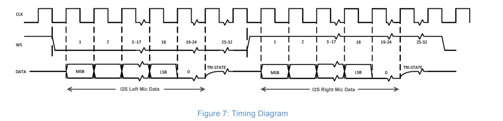

# Building the Program (from WSL setup)
Configure WSL USB Passthrough: 
-Run *usbipd list* from Powershell 
-Find BUSID of ESP32. ESP will show up on a COM port as USB to UART bridge 
-Run *usbipd attach --busid <BUSID> --wsl Ubuntu-22.04*
# Setup Enviroment in WSL
-Check if passthrough has been configured correctly. Run *ls /dev/ttyUSB* 
-From ~/esp-idf, run *source ./export.sh* 
-Build the program: Run *idf.py build* from fourierSight directory
-Flash the ESP: Run *idf.py -p /dev/ttyUSBX* 
-Open serial monitor: Run *idf.py -p /dev/ttyUSBX monitor*cd
# Usage of SPH0645 I2S Microphone
## SPH0645 Pinout

**BCLK**: Bit Clock for data line
**WS**: Word (slot) select line. (Used to select data from left or right mics in stero mode)
**D~OUT~**: Serial Data I/O

-Device is I2S slave so BCLK and WS must be supplied by the Proc
-**OSR** (oversampling rate) = 64. Thus, WS must be BCLK/64
-Data format is 24-bit, 2's complement, MSB first, 18-bit precision

# Design Notes: 
-Read in the I2S samples via DMA (completion of a transfer raises an IRQ)
-Compute FFT from a ping-pong buffer (controled by ISR)
-Update LEDs when FFT computation is complete (use freeROTS primitive to do this)